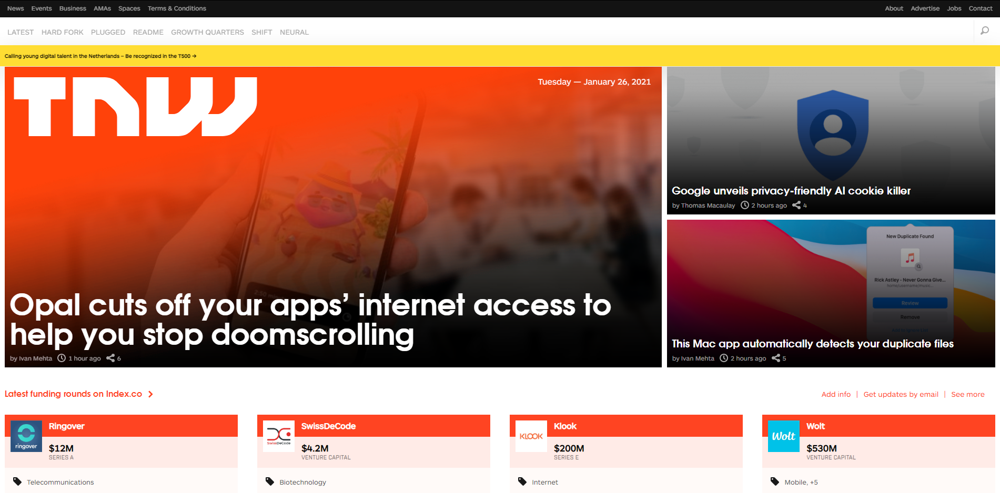

# The Next Web Home Page

> This is a clone of The Net Work Website webpage using HTML & CSS: https://perma.cc/M5ZV-Q2D6 . The goal of 
> To achieve this, the project makes use of HTML5 and CSS3 and focuses on the web responsivity aspects of the project, making use of media queries to achieve this.

## Built With

- HTML5 , CSS3
- Windows, Linux

## Live Demo

[Live Demo Link]( https://vitorelourenco.github.io/TheNextWebClone/ )

### Deployment

-You can deploy this project cloning it on GitHub and then going to:
->Repository
->Settings
->GitHub Pages
(Select source)
->Save

## Authors

👤 **Author1**

- GitHub: [@vitorelourenco](https://github.com/vitorelourenco/)
- Twitter: [@Vitorel](https://twitter.com/Vitorel)
- LinkedIn: [vitoremanuellourenco](https://www.linkedin.com/in/vitoremanuellourenco/)

👤 **Author2**

- GitHub: [Maha-Magdy](https://github.com/Maha-Magdy)
- Twitter: [@Maha_M_Abdelaal](https://twitter.com/Maha_M_Abdelaal)
- LinkedIn: [Maha Magdy](https://www.linkedin.com/in/maha-magdy-18a8a7116/)

## 🤝 Contributing

Contributions, issues, and feature requests are welcome!

Feel free to check the [issues page](issues/).

## Show your support

Give a ⭐️ if you like this project!

## Acknowledgments

- The Next Web ( https://thenextweb.com/ )
- Microverse ( https://www.microverse.org/ )

## 📝 License

This project is [MIT](lic.url) licensed.

